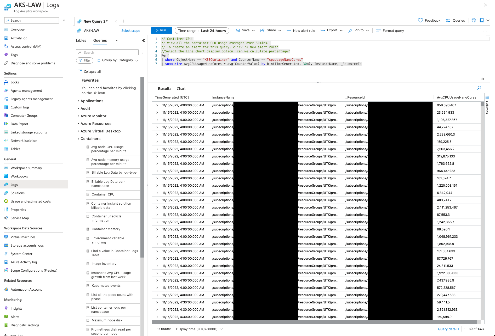

Example Voting App
=========

Based on [dockersamples/example-voting-app](https://github.com/dockersamples/example-voting-app)

Time spent: ~25 Hours

Architecture
-----

* A front-end web app in [Python](/vote) which lets you vote between two options
* A [Redis](https://hub.docker.com/_/redis/) queue which collects new votes
* A [.NET Core](/worker/src/Worker) worker which consumes votes and stores them in…
* A [Postgres](https://hub.docker.com/_/postgres/) database backed by a PVC
* A [Node.js](/result) webapp which shows the results of the voting in real time

A simple distributed application running across multiple Docker containers.

Deployment
---------------
1. Assuming that GitHub Flow is used.
2. Application is deployed to a Kubernetes Cluster with a production namespace, and namespaces for different PRs.
3. Each PR gets built in a new Kubernetes namespace, and a CNAME Record is added to the DNS Server for accessing the application.
4. After pushing code to the master branch, a new image is built, and is deployed to the namespace with `latest` tag.
5. The [Kubernetes Manifest](/kube-deployment.yml) is available
6. GitHub Actions Service account and its bindings are available [here](/serviceaccount.yml).
7. Logs for containers are visible through Log Analytics Workspace in Azure Monitor (Assuming it is deployed to Azure of course.) This serves as a cornerstone for further logging improvements.

Proposed Improvements
--------------------------
1. Deleting the namespaces after merging the code with the master branch and removing DNS Records. Easily achievable since the SHA of the commit is used for naming the namespaces and DNS records.
2. Storing the database as a separate resource in the cloud provider or a Stateful Set. This would require a little bit of tweaking in the code but is outside the scope of the current project.
3. Separating the codebase for each microservice into its own repository for better management.
4. Adding a private container registry such as `ACR` instead of using DockerHub.
5. For a more complex architecture, a helm chart can be used. In this case, it would be too overkill.
6. Employing a deployment strategy such as Canary or Blue/Green Deployment.
7. Setting resource limits for each container.
8. Dividing dev/test workloads and production workloads over different clusters.